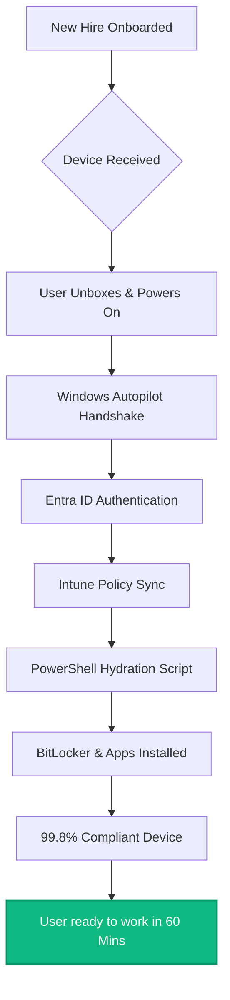

# Case Study: 1,000-User Enterprise Cloud Transformation

**Role:** Cloud Infrastructure Lead / Systems Architect  
**Org:** Renewable Energy Company
**Impact:** 99.8% Endpoint Compliance | Zero Downtime | 93% Onboarding Acceleration  

---

## 🚀 Executive Summary
Led the end-to-end migration of a 1,000-user enterprise environment from legacy on-premises infrastructure to a modern Microsoft 365 cloud ecosystem. This project eliminated multi-million shilling hardware dependencies and established a "Work from Anywhere" framework with near-perfect endpoint compliance.

## 🛠️ The Challenge
* **Infrastructure Debt:** Legacy on-prem servers were costly to maintain and created single points of failure for a distributed workforce.
* **Provisioning Latency:** Manual "hands-on" provisioning took 4+ hours per device, creating massive IT bottlenecks.
* **Security Gaps:** Lack of unified management meant inconsistent patching and high vulnerability to local threats.

## 📈 The Strategy: Zero-Touch Provisioning
I implemented a modern management framework designed for speed and security:

1.  **Modern Management:** Leveraged **Microsoft Intune** and **Windows Autopilot** to enable a zero-touch deployment model—shipping devices directly to users.
2.  **Identity Consolidation:** Unified 1,000+ identities into **Entra ID**, enabling Single Sign-On (SSO) and Conditional Access across the SaaS stack.
3.  **Data Integrity:** Orchestrated the migration of terabytes of data from local file shares to SharePoint and OneDrive with 0% data loss during cutover.

## 📊 Results: Scaling for Growth

| Metric | Legacy (Manual) | Post-Migration (Automated) | Strategic Value |
| :--- | :--- | :--- | :--- |
| **Onboarding Speed** | 4 Hours / Device | 1 Hour | **75% Increase in Speed** |
| **Endpoint Compliance**| 65% (Inconsistent) | 99.8% (Enforced) | **Audit-Ready Status** |
| **Hardware Costs** | High Capex | Optimized Opex | **30% Annual Savings** |

## 💡 Key Takeaways
* **User Empowerment:** Technology is most effective when it gets out of the user's way. Zero-touch provisioning removed the "IT friction" from the first day of work.
* **Global Readiness:** By moving the perimeter to the Cloud, we enabled the organization to recruit and operate globally without local infrastructure constraints.
